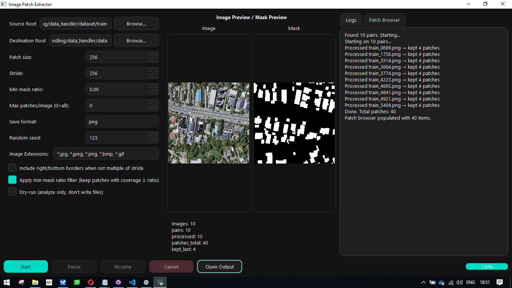

# Image Patch Extractor

A desktop application for extracting image patches and their corresponding masks from a dataset. This tool is designed to streamline the process of creating datasets for computer vision tasks like semantic segmentation.

  <!-- You can replace this with a real screenshot -->

## Features

- **Graphical User Interface**: Easy-to-use interface built with PyQt5.
- **Flexible Configuration**:
    - Set custom patch sizes and strides.
    - Filter patches based on the percentage of the mask present.
    - Limit the maximum number of patches extracted per image.
    - Include or exclude patches from image borders.
- **Live Preview**: See a sample of the source image and mask.
- **Patch Browser**: View and inspect the generated patches and their masks directly within the app.
- **Dry Run Mode**: Analyze the extraction process and see statistics without writing any files.
- **Cross-Platform**: Works on Windows, macOS, and Linux.

## Installation

1.  **Clone the repository:**
    ```bash
    git clone <your-repo-url>
    cd data_handler
    ```

2.  **Create and activate a virtual environment:**
    ```bash
    # On Windows
    python -m venv venv
    .\venv\Scripts\activate

    # On macOS/Linux
    python3 -m venv venv
    source venv/bin/activate
    ```

3.  **Install the dependencies:**
    ```bash
    pip install -r requirements.txt
    ```

## Usage

1.  **Run the application:**
    ```bash
    python main.py
    ```

2.  **Configure the extraction:**
    - **Source Root**: Select the root folder containing your dataset. This folder should have subdirectories for images (e.g., `Image`) and masks (e.g., `Mask`).
    - **Destination Root**: Select the folder where the extracted patches will be saved.
    - Adjust the **Patch size**, **Stride**, and other parameters as needed.

3.  **Start the process:**
    - Click the **Start** button to begin the extraction.
    - You can **Pause**, **Resume**, or **Cancel** the process at any time.
    - The progress bar will show the current status.

4.  **Browse the results:**
    - Once the process is complete, the "Patch Browser" tab will be populated with the generated patches.
    - Click on any patch to see a preview of the image and its corresponding mask.

## License

This project is licensed under the MIT License. See the [LICENSE](LICENSE) file for details.
